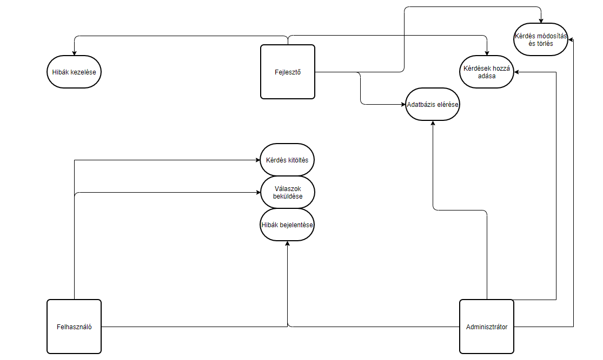
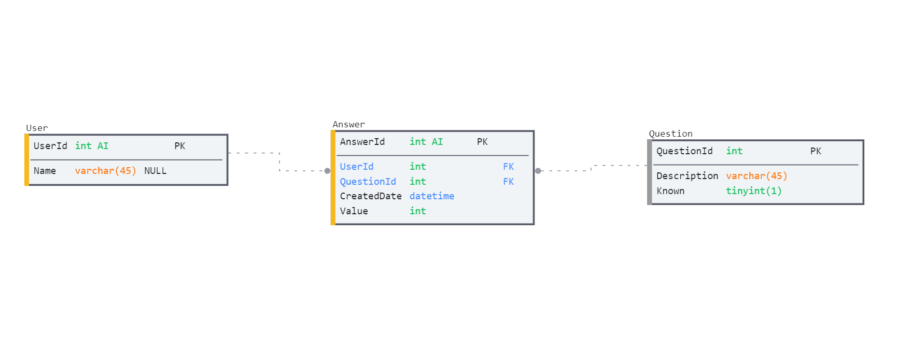

# Rendszerterv

A rendszer célja
---

A rendszer célja egy olyan weboldal létrehozása melyen keresztül a felhasználó kérdőívet tölthet ki melyben kéréseket tud megválaszolni egyszerűen letisztult felület mellett. A kérdésekre számértékekkel lehet majd válaszoni melyet a rendszer adatbázisban ment el, hogy  az adatok feldolgozása  könnyen elvégezhető legyen. Két fajta kérdéstípust külömböztetőnk meg jelen esetben, vannak olyan kérdések melyekre a felhsználó háttér ismerete alapján tudhatja a választ, illetve vannak olyan kérdések melyekre a felhasználó becslést ad. Azért, hogy elkerüljük azokat az eseteket melyekben a felhasználó a kérdésekre a választ az internet segítségével találja meg, az egyes kérdésekhez vagy kérdés csoportokhoz időlimitet állítunk be melynek lejárta előtt a felhasználónak választ kell adni az adott kérdésre/kérdésekre. Az ilyen típusú kérdések melyekre a felhasználó tudhatja a választ, azért van szükség, hogy a feldolgozás során a feldolgozást végző eldönthesse, hogy figyelembe akarja e venni azt az egyes kérdések kiértékelésénél, hogy az adott illető jártas volt e az adott témában vagy sem.

Üzleti folyamatok modellje
--------------------------

Követelmények
---
- A kérdések szám adatokkal megválaszolhatóak kell legyenek.
- A kérdésekre adott válaszokat adatbázisban kell eltárolni.
- Egy kapcsoló segítségével be kell lehessen állítani, hogy a tudást felmérő kérdések illetve a becslés képességet felmérő kérdések vizuálisan megkülömböztethetőek legyenek vagy sem.
- Az egyes kérdésekhez/kérdés csoportokhoz időlimitet kell beállítani amely a felhasználó számára is egyértelműen látható
- Egy admin felületet kell biztosítani az új kérdések hozzáadásanak lehetősége érdekében.
- Minden felhasználótol az adatbázisban szereplő összes kérdést meg kell kérdezni, de ezt nem feltétlen azonos sorrendben.
- A GDPR-nek való megfelelés.

Funkcionális terv
---

##### Rendszerszereplők:
Adminisztrátor
Felhasználó

##### Rendszerhasználati esetek és lefutásuk:

Adminisztrátor:
* Teljes hozzáférése van a rendszerhe
* Adatbázis tartalmát látthatja, válltoztathatja
* Felhasználói adatok módosítása
* Kérdések hozzáadása/törlése/válltoztatása

Felhasználó:
* Opcionális email cím megadás
* Ki kell tölteni a válaszokat, nem lehet átugorni
* A végén beküldi a válaszait

Adatbázis terv
---
Az adatokat MySQL-ben fogjuk tárolni az alábbi séma szerint:

Tesztterv
---
A tesztelések célja a rendszer és komponensei funkcionalitásának
teljes vizsgálata, ellenőrzése, a rendszer által megvalósított üzleti
szolgáltatások verifikálása.

Tesztelési eljárások:

- **Unit teszt:**

Ahol csak lehetséges, szükséges már a fejlesztési idő alatt is tesztelni, hogy a
metódusok megfelelően működnek-e.
Ezért a metódusok megfelelő működésének biztosítására mindegyikhez írni
kell Unit teszteket, a minél nagyobb kódlefedettséget szem előtt tartva. A
metódusok akkor vannak kész, ha a tesztesetek hiba nélkül lefutnak az egyes
metódusokon.

- **Alfa teszt:**

A teszt elsődleges célja: az eddig meglévő funkcióknak a különböző
böngészőkkel való kompatibilitásának tesztelése. A tesztet a
fejlesztők végzik.
Az eljárás sikeres, ha különböző böngészőkben megfelelően működnek a különböző funkciók. A teszt időtartama egy-két hetet vehet igénybe a javításaokkal és azok újratesztelésével együtt.

- **Béta teszt:**

Jelen esetben nem áll módunkban béta tesztet elvégezni.
